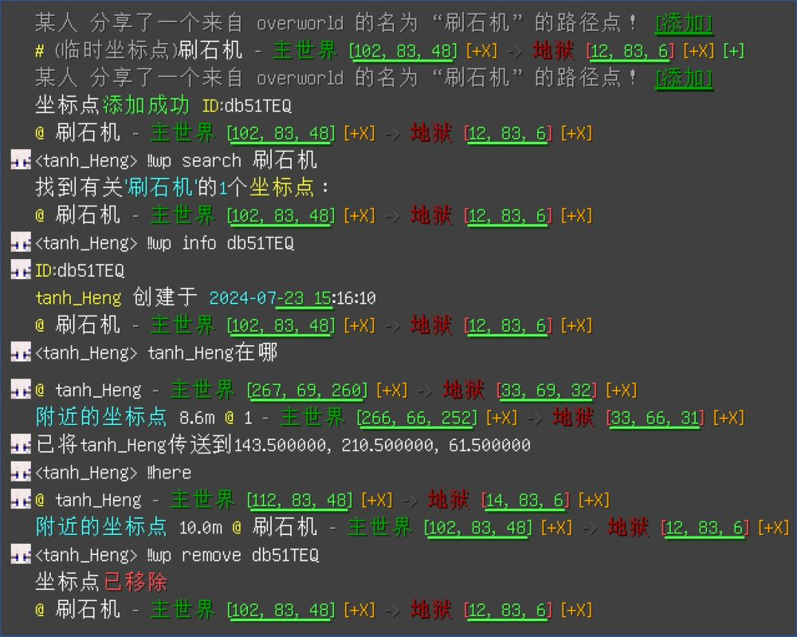

# Where2go
一个功能强大的位置插件，包含共享坐标点、查询玩家位置等功能

# 功能

*README中指令全部按照默认配置文件书写，指令前缀可通过配置文件更改*

## 共享坐标点

`!!wp add <xaero-waypoint>` 添加Xaero坐标点

在Xaero地图中分享坐标点后，插件可**自动识别**。点击临时坐标点后方的`[+]`即可添加。若两个坐标点距离过近，插件会进行提示，以防重复添加。

`!!wp remove <id>` 移除坐标点

`!!wp list [page]` 列出所有的坐标点。`page`为可选项，不填则默认为`1`

`!!wp search <name>` 按照坐标点名称`name`搜索坐标点

`!!wp info <id>` 查看id为`id`的坐标点详情

## 更先进的!!here与!!vris

`!!here` 广播自身位置。若100m内有坐标点，则同时提示"附近的坐标点"

`!!vris <player>` 查询玩家`player`位置。若该玩家100m内有坐标点，则同时提示"附近的坐标点"

此功能用于快速辨别玩家位置，如玩家位于全物品附近。同时在部分情况下可以快速找到该玩家附近的地狱门

## 更”智能“的查询

聊天发送`XXX在哪`即可快速查询坐标点`XXX`或玩家`XXX`的位置

# 演示

# ToDo

- [ ] 将主世界和地狱的两个坐标点进行关联
- [ ] `!!wp add here/<player>`快速将玩家位置添加为坐标点