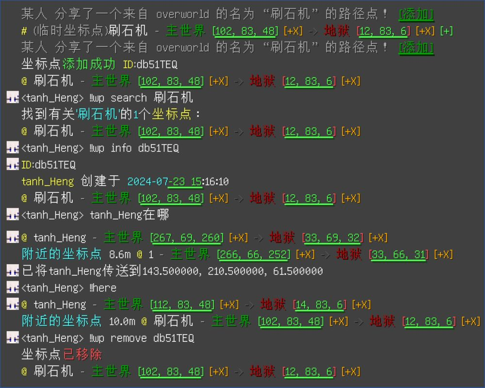

# Where2go
一个功能强大的位置插件，包含共享坐标点、查询玩家位置等功能

# 依赖

**Python**

- `Python >= 3.10`

**MCDR插件**

- [MinecraftDataAPI](https://github.com/Fallen-Breath/MinecraftDataAPI)

# 功能

*README中指令全部按照默认配置文件书写，指令前缀可通过配置文件更改*

## 共享坐标点

`!!wp add <xaero-waypoint>` 添加Xaero坐标点

在Xaero地图中分享坐标点后，插件可**自动识别**。点击临时坐标点后方的`[+]`即可添加。若两个坐标点距离过近，插件会进行提示，以防重复添加。

`!!wp addpos <x> <y> <z> <dimension> <name>` 

添加名为`name`，坐标为`(x, y, z)`，位于`dimension`维度的坐标点。对于原版维度，`dimension`可以为`overworld` `the_nether` `the_end`或分别简写为`o` `n` `e`

`!!wp addhere <name>` 将玩家当前位置添加为名为`name`的坐标点

`!!wp remove <id>` 移除坐标点

`!!wp link <id> <target_id>` 建立两个坐标点之间的连接。例如连接下界传送门的两侧，或末地折跃门的两端。连接后查询坐标点时会自动显示对应维度的链接目标

`!!wp unlink <id>` 解除坐标点的连接

`!!wp autolink [page]` 自动为未连接的坐标点寻找合适的连接目标

`!!wp list [page]` 列出所有的坐标点。`page`为可选项，不填则默认为`1`

`!!wp search <name>` 按照坐标点名称`name`搜索坐标点

`!!wp info <id>` 查看id为`id`的坐标点详情

## 更先进的!!here与!!vris

`!!here` 广播自身位置。若100m内有坐标点，则同时提示"附近的坐标点"

`!!vris <player>` 查询玩家`player`位置。若该玩家100m内有坐标点，则同时提示"附近的坐标点"

此功能用于快速辨别玩家位置，如玩家位于全物品附近。同时在部分情况下可以快速找到该玩家附近的地狱门

## 更”智能“的查询

聊天发送`XXX在哪`即可快速查询坐标点`XXX`或玩家`XXX`的位置

## 演示

## 配置文件

### xaero

**click_event_format** `str`, `list`

- 添加Xaero坐标点的按钮格式。可选：
  + `"old"`：样式为金色的`[+X]`，支持 Xaero's Minimap v24.x及以下版本。
  + `"new"`：样式为黄色的`[+X]`，支持 Xaero's Minimap v25.x及以上的版本。
  + 列表格式，如`["old", "new"]`，样式为`[+X]（金色） [+X]（黄色）`，点击前一个按钮可以使旧版Xaero添加坐标点，点击后一个按钮可以使新版Xaero添加坐标点。
- **[注意]**：客户端请务必安装[LetMeClickAndSend](https://modrinth.com/mod/let-me-click-and-send)模组

### command

**waypoints** `str`
- 坐标点相关指令的指令前缀

**whereis** `str`
- 查询玩家位置的指令前缀

**here** `str`
- 发送自身位置的指令

**fastsearch_regex** `str`
- 快速询问的正则匹配。如果你想要支持英文，可以改成像这样：`[wW]here ((is)|(are)|(r)) (?P<name>\w+)\??`

**fastsearch_prompt** `str`
- 快速询问在MCDR的`!!help`界面显示的命令帮助

### player_api

获取玩家位置等指令、识别指令回显相关。一般服务端无需更改。

### 

# ToDo

- [x] 将主世界和地狱的两个坐标点进行关联
- [x] `!!wp add here/<player>`快速将玩家位置添加为坐标点